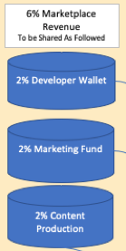
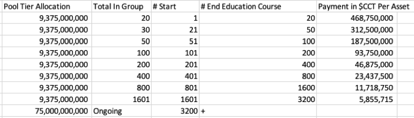
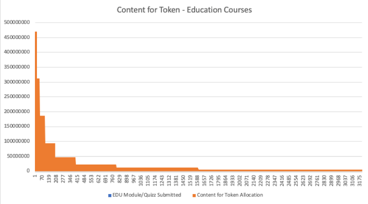

# Submit Education Courses for EDU Marketplace

Content providers still make 94% of all sales completed on the marketplace!

Pricing will be set by our markets for pricing stability and usage/growth.&#x20;

It is good to note that courses provided to us will be sold on the marketplace which will only have a 6% marketplace fee.&#x20;

The remaining 94% will be provided to content provider who made it. The content for token for these is an up front bonus to fill our marketplace!

Upon education material being voted and approved for the EDU Marketplace, payments for tiers will be as follows:

