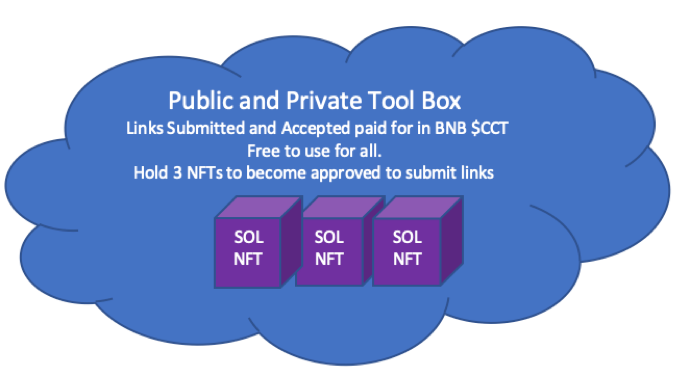

# Crypto Dictionary

The Crypto Dictionary is the backbone of learning concepts and terms. This will be free for all to use.&#x20;

**What is a Crypto Dictionary?**

Basically an easy to use website with an organized set of terms and concepts for you to drill down and review at your pace. This is meant to be like a crypto wiki...our plan is also to link up terms with their corresponding toolbox links available. Hope to excel exploration in our space!

Submitting new concepts and terms to the Crypto Dictionary will get you [payment-tiers](../../group-1/payment-tiers/ "mention")!

To be able to submit concepts and become a verified creator for Content for Token, you will need to hold at minimum 3 Collection Project NFT.

