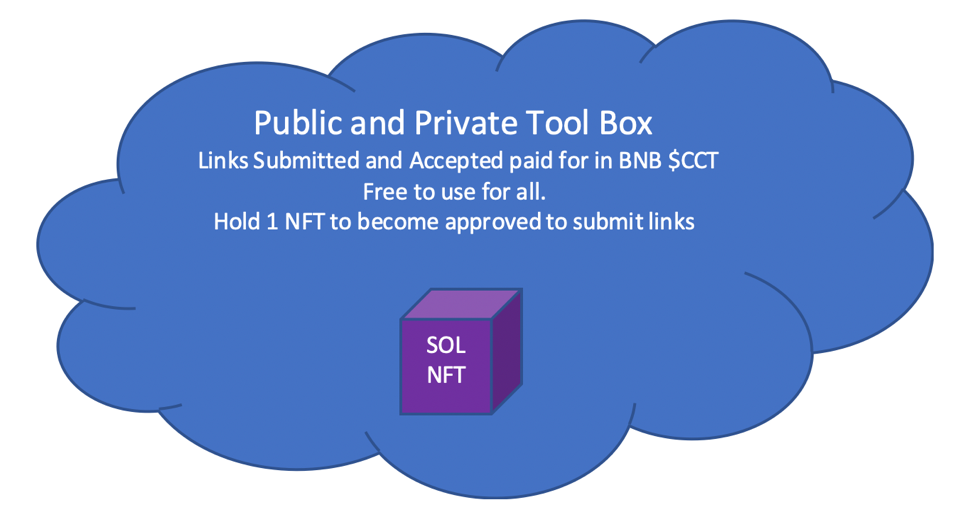

# Public Tool Box

The Public Tool Box is the foundation of our learning experience and the go to spot for vetted projects in blockchain. This will be free for all to use.&#x20;

**What is a Public Toolbox?**

Basically an easy to use website with an organized set of links related to web3.0 tools and information we find relevant to assist in some way with blockchain. This is a free organized set of links for everyone forever. We plan on building an easy to access toolbox for everyone to start being able to actually use crypto instead of just holding it. By holding tokens and NFT’s you will have access to premium toolbox features through our web3.0 verification system. We will add more and more blockchains over time.

Submitting links to the toolbox will get you [payment-tiers](../../../group-1/payment-tiers/ "mention")!

To be able to submit links to the Public Tool Box and become a verified creator for Content for Token, you will need to hold at minimum 1 Collection Project NFT.

