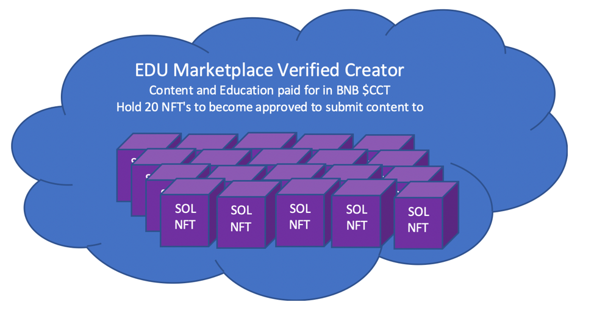

# Education Marketplace

The EDU Marketplace will be where you can purchase and take education courses to gain experience NFT's for your profile that eventually can be shared. You will need to hold 1 Collection Project NFT or a certain number of $CCT to have access.&#x20;

Submitting links to the toolbox will get you [content-for-token](../content-for-token/ "mention")!

To be able to submit education courses for sale on our EDU Marketplace and become a verified EDU Content Provider for Content for Token, you will need to hold at minimum 20 Collection Project NFTs.

