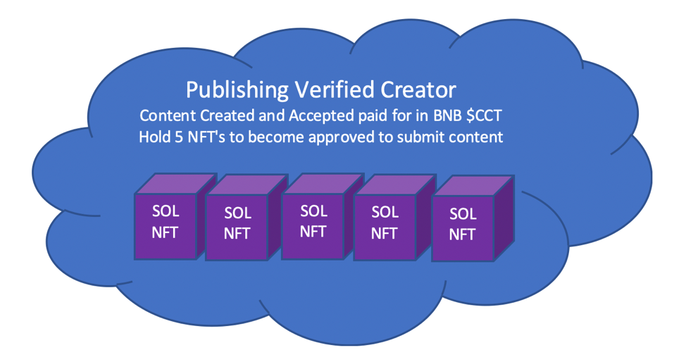

# Private Publishing View

Our Private Publishing View is our "Blockchain Newspaper" section and one of our core main utilities of all assets used of the platform. This section will be for Content Providers to submit relevant content for Holders of our $CCT token and any of our Collection Project NFT's to view. This content is protected and accessed utilizing the blockchain.&#x20;

Submitting articles and content for the Publishing View will get you [content-for-token](../../../cryptocorner.finance-platform-assets-and-utilities/content-for-token/ "mention")!

Content providers will also be able to take advantage of our up and coming feature [content-tipping.md](../../../cryptocorner.finance-platform-assets-and-utilities/content-for-token/submitting-articles-and-content-for-private-publishing-view/content-tipping.md "mention")!

To be able to submit content and articles for the Publishing View and become a verified creator for Content for Token, you will need to hold at minimum 5 Collection Project NFT.

